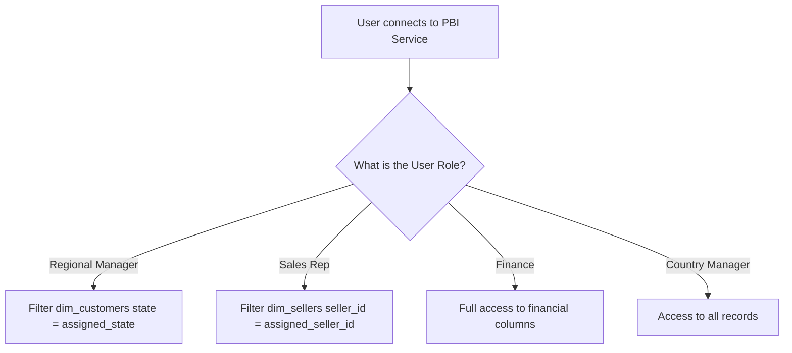

# Power BI Enterprise Modeling & Security Architecture

This architecture document details the model configurations, performance best practices, security governance (RLS), and database scaling strategies implemented in this project.

---

## 1. Power BI Modeling Best Practices

To maintain a clean and performant data model, the reporting layer follows strict enterprise BI standards:

### 1.1 Model Organization
*   **Dedicated Measure Table:** All DAX measures are stored in a dedicated, empty table named `_Measures`. This separates dynamic calculations from the physical columns of the data warehouse.
*   **Display Folders:** Measures are grouped into display folders (e.g., `_Measures\Financials`, `_Measures\Logistics`, `_Measures\Sentiment`, `_Measures\Time Intelligence`) to make model navigation easy for report builders.
*   **Hide Technical Columns:** All primary keys, foreign keys, and surrogate keys (e.g., `customer_unique_id`, `product_id`, `seller_id`, `order_id` inside fact tables) are hidden in the Report View. This prevents users from using IDs directly in visuals and forces them to use dimension columns instead.

### 1.2 Resource Management
*   **Disable Auto Date/Time:** The global Power BI setting "Auto Date/Time for new files" is disabled. This prevents Power BI from generating hidden date tables for every date/datetime field in the model, reducing file size and memory footprint.
*   **Single-Direction Relationships:** Relationships are set to 1-to-many, with cross-filtering set to **Single** (pointing from the Dimension to the Fact). **Bidirectional cross-filtering is avoided** unless strictly necessary, as it can cause ambiguous filter paths, slow down the VertiPaq engine, and distort aggregations.

---

## 2. Row-Level Security (RLS) Governance Model

Access control is implemented in Power BI to ensure users only see the data they are authorized to view.



### 2.1 Static RLS Profiles
We configure roles in Power BI Desktop under **Modeling → Manage Roles**:

*   **Regional Manager (e.g., São Paulo Region):**
    *   **Filter criteria:** Applied to `dim_customers`
    ```dax
    [customer_state] = "SP"
    ```
    *   *Business Rule:* Restricts regional managers to customer transactions within their assigned state.

*   **Sales Representative (e.g., Seller-Specific Account):**
    *   **Filter criteria:** Applied to `dim_sellers` (or `fact_order_items`)
    ```dax
    [seller_id] = "344e669e4624d6fe3583c5Fcfb0377d2"
    ```
    *   *Business Rule:* Restricts individual merchants to viewing only their own orders and pricing.

*   **Country Manager (National Market):**
    *   **Filter criteria:** No constraints on customer/seller states.
    *   *Business Rule:* Access to all national transaction records.

### 2.2 Dynamic RLS (Enterprise Pattern)
For scalability, enterprise deployments use a dynamic lookup mapping table rather than static roles:

1.  **Lookup Table (`rls_user_mapping`):**
    *   Columns: `user_email` (e.g. `manager@company.com`), `assigned_state` (e.g. `SP`).
2.  **Model Relationship:** Connect `rls_user_mapping[assigned_state]` to `dim_customers[customer_state]` with cross-filtering set to **Both** and **Apply security filter in both directions** enabled.
3.  **Role DAX Rule:**
    ```dax
    [user_email] = USERPRINCIPALNAME()
    ```
    *This dynamic design automatically filters the dataset based on the user's logged-in email without requiring manual role adjustments when staff changes occur.*

---

## 3. Enterprise Scalability Roadmap

Although the Olist dataset is relatively small, this pipeline is designed to scale to billions of transaction rows using the following strategies:

### 3.1 Table Partitioning
In the PostgreSQL database layer, large facts like `fact_order_items` are partitioned by date range (e.g., monthly partitions):
```sql
CREATE TABLE fact_order_items_partitioned (
    order_id CHAR(32),
    purchase_date DATE,
    ...
) PARTITION BY RANGE (purchase_date);
```
*This allows the database to read only the partition of the relevant month during queries, avoiding a full-table scan.*

### 3.2 Materialized Views
In production, views that perform heavy aggregations (e.g. `vw_sales_summary`) are converted to **Materialized Views**. Historical partitions are refreshed once daily off-hours, while the current month is kept as a standard view. This caches aggregation queries directly on disk, reducing DirectQuery runtimes to milliseconds.

### 3.3 Hybrid Storage & Aggregation Tables (Power BI)
For large-scale datasets, we combine storage modes:
1.  **Import Mode (Aggregations):** High-level summary tables (e.g., sales by year-month and category) are imported into memory to ensure fast render times for main dashboard KPIs.
2.  **DirectQuery Mode (Transactions):** Detail tables (e.g., individual order item details) are kept in DirectQuery mode.
3.  **Drill-through:** When an executive clicks on a summary card and drills down to individual order lines, Power BI queries the PostgreSQL database in real-time, keeping the memory footprint minimal.
